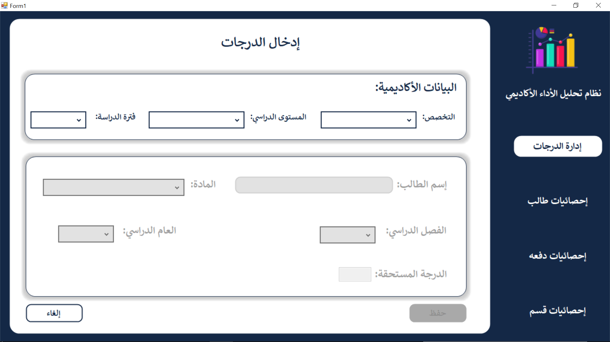
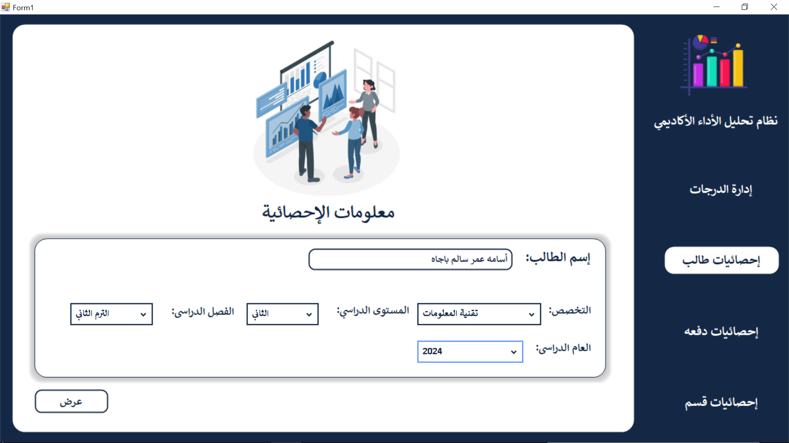
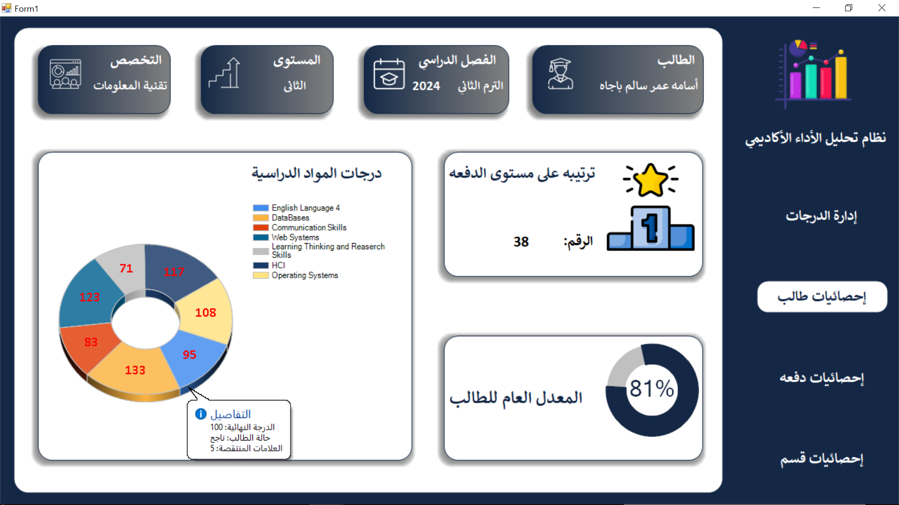
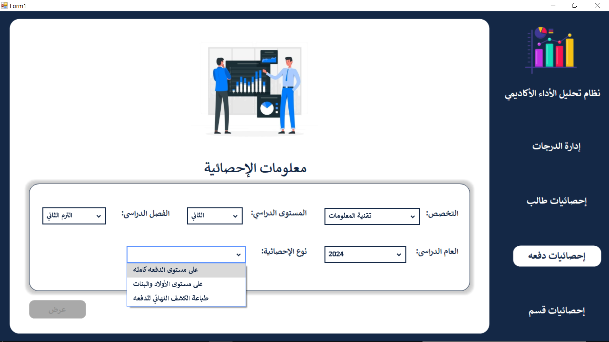
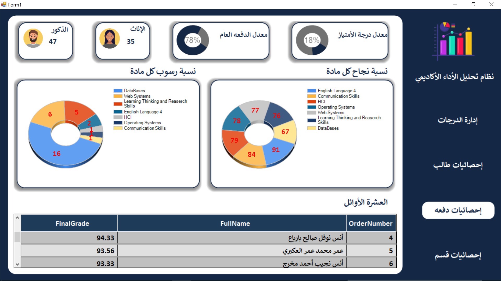
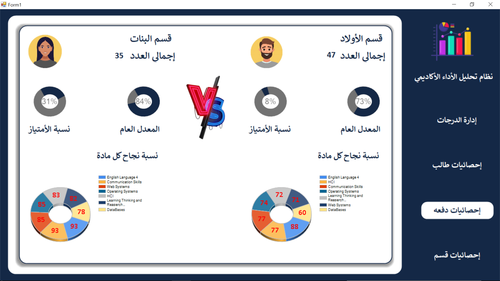
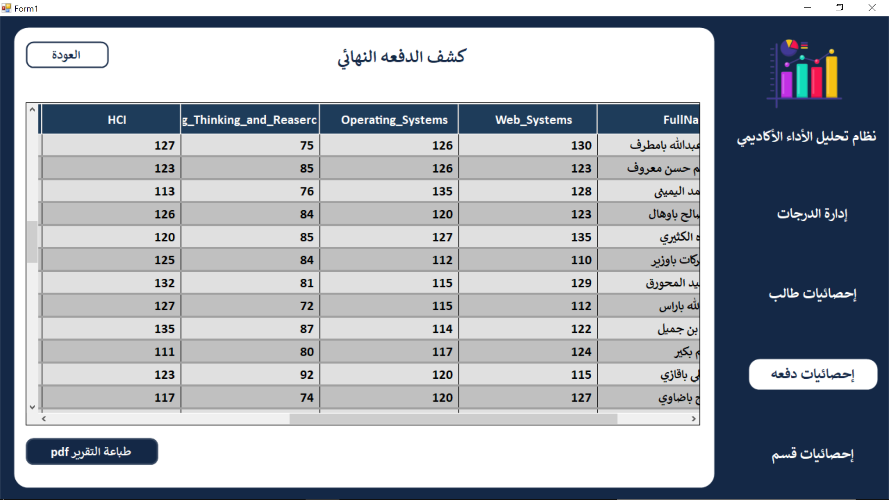

# 🎓 Academic Performance Analyzer | محلل الأداء الأكاديمي

مشروع مكتبي يساعد في **تحليل أداء الطلاب الأكاديمي** من خلال تسجيل الدرجات وإنشاء تقارير ذكية ومفصلة على مستويات متعددة.

## 📌 وصف المشروع

يتيح هذا النظام للمدارس أو الأقسام الأكاديمية:

- 📥 تسجيل درجات الطلاب بدقة.
- 📊 إنشاء تقارير على مستوى:
  - الدفعة كاملة
  - الطلاب والطالبات بشكل منفصل
  - طالب محدد وتحليل أدائه الفردي

✨ يساعد هذا في اتخاذ قرارات تعليمية مبنية على البيانات!

## 🛠️ التقنيات المستخدمة

- 💻 C# (Windows Forms)
- 🗃️ قواعد بيانات (SQL)
- 🧠 برمجة قواعد البيانات (Stored Procedures - Queries)

## 🖼️ صورة من واجهة النظام

## 🚀 طريقة التشغيل

1. حمل المشروع (Clone or Download).
2. افتح الملف في Visual Studio.
3. تأكد من ربط قاعدة البيانات.
4. شغّل المشروع وابدأ بإضافة بيانات الطلاب!

## 📬 تواصل معي

لو أعجبك المشروع، لا تنسَ تعمل ⭐  
وأي اقتراح أو تطوير، الباب مفتوح دائمًا! 💬

---

> 💡 مشروع تم إنشاؤه بشغف من طالب تقنية معلومات - المستوى الثالث ❤️
